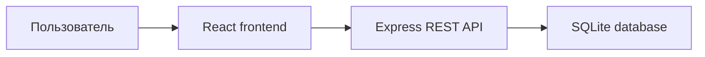

# Архитектура проекта

## Общая схема

## Архитектурные уровни

### Frontend

Frontend находится в каталоге `src/` и отвечает за:

- маршрутизацию интерфейса;
- отображение страниц;
- управление сессией пользователя;
- вызовы backend API;
- ролевой доступ к разделам приложения.

Ключевые модули:

- `src/routes/` — маршруты приложения;
- `src/pages/` — страницы по сценариям пользователя;
- `src/context/` — глобальное состояние и авторизация;
- `src/services/api.js` — единая точка работы с API;
- `src/components/` — переиспользуемые UI-компоненты.

### Backend

Backend находится в каталоге `server/` и отвечает за:

- авторизацию и регистрацию;
- обработку бизнес-логики;
- проверку ролей и прав доступа;
- выдачу данных для frontend;
- работу с базой данных SQLite.

Ключевые модули:

- `server/routes/` — REST API-маршруты;
- `server/services/clubService.js` — основная бизнес-логика;
- `server/middleware/` — JWT-аутентификация и обработка ошибок;
- `server/db/` — подключение и инициализация базы.

### База данных

SQLite используется как встроенное хранилище и содержит таблицы:

- `users` — учетные записи пользователей;
- `participants` — спортсмены;
- `parent_children` — связь родителя с ребенком;
- `sections` — спортивные секции;
- `section_participants` — состав секций;
- `schedule` — расписание тренировок;
- `attendance` — журнал посещаемости;
- `achievements` — достижения спортсменов.

## Ролевая модель

- `admin` — полный доступ к статистике, расписанию и данным системы;
- `coach` — работа с расписанием и посещаемостью;
- `athlete` — доступ к своему профилю, посещаемости и достижениям;
- `parent` — доступ к данным привязанного ребенка и записи в секции.

## Основные сценарии

### 1. Авторизация

1. Пользователь вводит e-mail и пароль.
2. Frontend отправляет `POST /api/auth/login`.
3. Backend проверяет пароль через `bcryptjs`.
4. Сервер возвращает JWT и профиль пользователя.
5. Frontend сохраняет токен и загружает защищенные данные.

### 2. Регистрация спортсмена или родителя

1. Пользователь заполняет форму регистрации.
2. Frontend отправляет `POST /api/auth/register`.
3. Backend создает учетную запись.
4. Для спортсмена создается участник и привязка `athleteId`.
5. Для родителя создается ребенок и связь через `parent_children`.
6. После регистрации пользователь автоматически входит в систему.

### 3. Запись в секцию

1. Спортсмен или родитель выбирает секцию.
2. Frontend отправляет `POST /api/sections/:sectionId/enroll`.
3. Backend проверяет права, вместимость и состав группы.
4. При успехе создается запись в `section_participants`.

### 4. Изменение расписания

1. Тренер или администратор выбирает тренировку.
2. Frontend отправляет `PATCH /api/schedule/:sessionId`.
3. Backend проверяет конфликт по тренеру и залу.
4. При успехе обновляет слот тренировки.

## Production-схема

После `npm run build` frontend собирается в `dist/`, а Express может отдавать этот каталог как единое production-приложение. Это упрощает деплой: достаточно одного Node.js сервиса.
